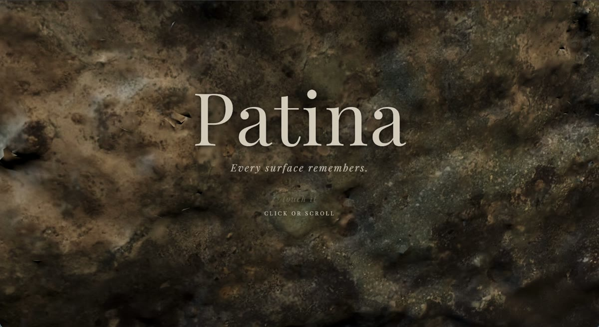
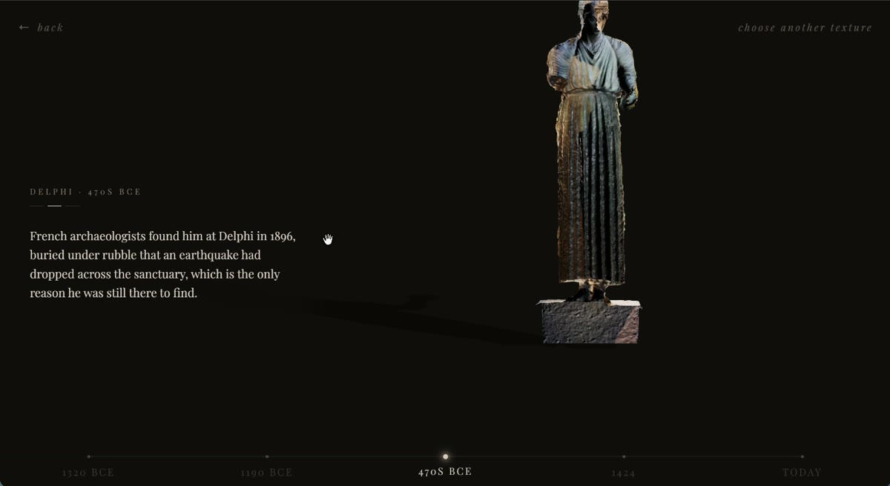
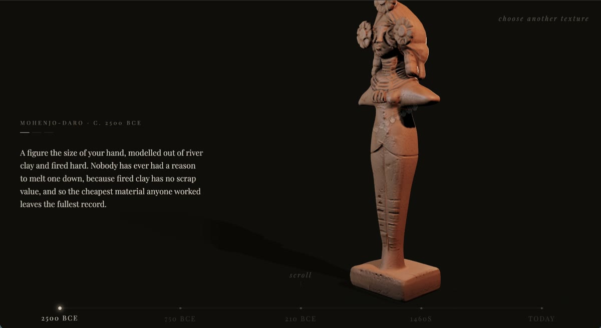
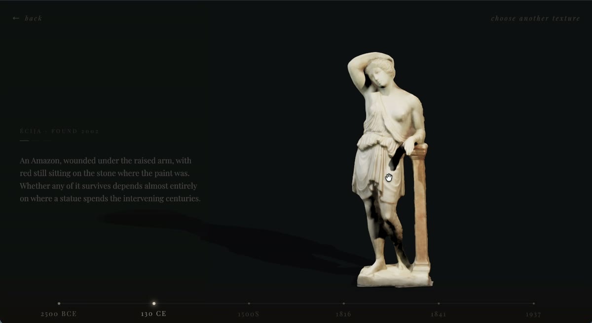
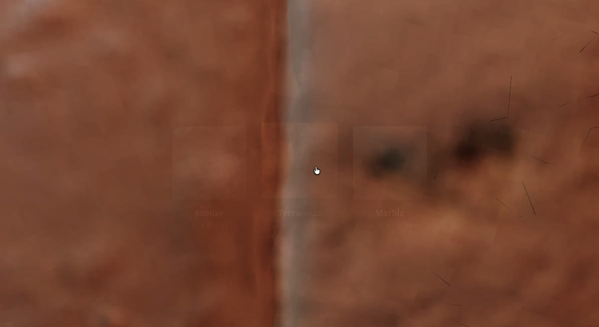

# Patina

**An interactive walk through history by material.** Scroll through bronze,
terracotta and marble, one real 3D-scanned artefact at a time, from a
4,500-year-old grave figurine to a $4.99 flowerpot. Built in vanilla
JavaScript with three.js, no framework and no build step.

**[▶ Open the live demo](https://patina-texture.vercel.app/)**

https://github.com/user-attachments/assets/de7786ec-5727-4c13-af9e-906c9d2fe398



---

## What it is

You start pressed against a surface, close enough that it is only texture. The
page asks you to touch it, and then to pick a material. From there you scroll,
and the object in front of you turns while a history of that one material walks
forward through time. There are no menus, no chapter screens and no cuts: to
reach the next object the camera presses into the surface you are looking at
until it fills the frame, swaps the geometry at maximum closeness, and pulls
back to reveal the next form. Every object is a real photogrammetry scan of the
real artefact, used under an open licence.

Sixteen objects across three threads, each thread making one argument:

| Thread | Spans | The argument |
| --- | --- | --- |
| **Bronze** | 1320 BCE → 1971 | A material that is never safe. It can always be melted back down, so nearly every large Greek bronze ever cast was eventually turned into something else and the survivors survived by accident. Runs from a copper ingot off a ship that sank around 1320 BCE to a war memorial in Baltimore. |
| **Terracotta** | 2500 BCE → today | The opposite, for the least flattering reason: fired clay has no scrap value, so nobody ever had a reason to melt a figurine down, and the cheapest material anyone worked leaves the fullest record. |
| **Marble** | 2500 BCE → 1937 | Whiteness as subtraction. Classical sculpture was painted, and the white we revere is what is left after pigment loss, burial, weathering and cleaning. It ends in 1937, when the British Museum took copper tools to the Parthenon frieze to reach the real marble it believed lay underneath, and removed the original worked surface instead. |

| | |
| --- | --- |
|  |  |
|  |  |

## Features

- **The camera never leaves the material.** Transitions are entirely in 3D:
  press in, swap at maximum closeness, pull back out. Nothing is ever a 2D
  crossfade between two views.
- **Reading an object rotates it exactly once.** Reading a piece all the way
  through is one full 360° turn, so finishing the text means you have seen every
  face of it. You can also grab and spin it by hand, and that stays separate
  from your reading position, so a drag never fights the scroll.
- **Scroll is metered by gesture, not by pixels.** One flick of a trackpad is
  one passage, however hard you threw it.
- **Lit like a museum case at 2am,** with a different room per material: the
  tungsten key that flatters clay and bronze renders white stone as sandstone,
  so marble gets a cooler, brighter rig of its own.
- **Ends where the material is now.** At the last object in each thread the
  museum lighting ramps up to flat fluorescent retail daylight over three
  seconds.
- **Works on touch,** where the first few pixels of a drag decide whether the
  gesture is a horizontal spin or a vertical scroll.

## Run it locally

There is no build step and nothing to install, but it does have to be served
over HTTP. Opening `index.html` off the filesystem fails silently, because the
ES module imports and the `.glb` fetches are both blocked on `file://`.

```bash
git clone https://github.com/sun616448/patina.git
cd patina
python3 -m http.server 8123
```

Then open http://localhost:8123/ .

Useful development flags: `?thread=marble` opens a different thread, `?node=3`
jumps to an object, `?debug` exposes the camera and reading state on
`window.__patina` for live tuning.

## Built with

| | Why |
| --- | --- |
| **Vanilla HTML/CSS/JS**, three ES modules | No build step, no bundler, no framework. One page and three script files is the right weight for a single linear experience, and keeps deploys to a static upload. |
| **[three.js](https://threejs.org/) 0.160** | WebGL rendering and glTF loading, loaded from a CDN through an importmap rather than npm, since there is nothing to bundle. |
| **[GSAP](https://gsap.com/) 3.12** | Every camera move and fade. Chosen over CSS transitions because the moves are on 3D camera position and material colour, not on DOM properties. |
| **Draco + KTX2 + Meshopt** | Mesh and texture compression, which is what makes the asset budget work at all. |

The source is split three ways: `js/threads.js` is pure story data with no
three.js or DOM dependency, `js/scene.js` owns the renderer, lighting and model
preparation, and `js/ui.js` owns the state machine and input. Markup and CSS
stay in `index.html`.

## Credits and licence

Every object is a real 3D scan published by its author under an open licence,
mostly CC BY 4.0, from Sketchfab and from the Cleveland Museum of Art, the
Smithsonian American Art Museum and the Hunt Museum. CC BY 4.0 requires
attribution wherever the work is shown, so the credits ship with the site and
every screen links to them.

[**CREDITS.md**](CREDITS.md) is the source of record; [credits.html](credits.html)
is the page the site itself links to, generated from it.
